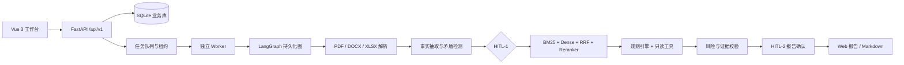

# CreditGuard AI PoC

授信智能合规审查平台的可运行 PoC。它把授信材料解析、事实抽取、矛盾检测、制度检索、确定性规则、风险解释和人工复核串成一条可追溯证据链。

> 本项目只使用合成数据，AI 结论是审查辅助草稿，不执行最终授信审批、额度决策或放款。

## 项目价值

- 支持 PDF、DOCX、XLSX 材料版本化上传与证据定位。
- 使用 LangGraph 持久化工作流表达两个 Human-in-the-loop 关口。
- 采用 BM25 + Dense + RRF + Reranker 的制度知识检索链路。
- 使用不可变 YAML 规则包执行 10 条确定性授信合规规则。
- 报告只展示有证据的结论，`UNSUPPORTED` 内容不会进入正式结论。
- 提供 RM 和 Reviewer 两个固定演示身份，以及正常/高风险两条浏览器路径。

## 演示截图

下列图片均来自本地合成演示，展示材料、事实、规则和报告页面：


完整演示过程见 [演示指南](docs/demo-guide.md)，短 GIF 见 [demo.gif](docs/assets/demo.gif)。

## 架构



LangGraph 的状态只保存 Run 标识、版本、阶段、快照引用和人工关口；文档全文、密钥和完整模型响应保存在受控存储或快照中，不进入 State。

## 快速开始（Windows）

```powershell
uv sync
npm.cmd --prefix web ci
.\dev.ps1
```

打开 <http://127.0.0.1:5173/>。API 文档在 <http://127.0.0.1:8000/docs>。

`dev.ps1` 会启用 `CREDIT_REVIEW_DEMO_MODE=true` 并启动 API、Worker 和 Web。直接启动 API 时 Demo 路由默认关闭；如需分别启动 Worker，请在项目根目录执行：

```powershell
$env:PYTHONPATH = "$PWD/backend"
uv run uvicorn app.main:app --app-dir backend --host 127.0.0.1 --port 8000
uv run python -m app.worker
npm.cmd --prefix web run dev
```

## 两条演示路径

1. 选择 `RM · 客户经理`，点击“创建正常演示”，案件 `DEMO-NORMAL-001` 会自动解析四类材料并进入报告复核。
2. 点击“创建高风险演示”，切换 `Reviewer · 审查员`，在事实复核中采用尽调报告的 48 个月；R07 将返回 `FAIL`，综合结论为 `NON_COMPLIANT`，随后可确认报告。

受控 Demo API 只有在 Demo 模式下注册：

```text
POST /api/v1/demo/scenarios/DEMO-NORMAL-001
POST /api/v1/demo/scenarios/DEMO-HIGH-001
```

请求必须携带 `X-Demo-User-Id: demo-rm` 和 `Idempotency-Key`，不接受路径、URL、SQL 或任意参数。

## 技术栈与目录

| 层 | 技术 |
| --- | --- |
| Web | Vue 3、TypeScript、Vue Router、Element Plus、Vite |
| API | FastAPI、Pydantic、SQLAlchemy 2、Alembic、SQLite |
| Workflow | LangGraph checkpoint、独立 Worker、租约任务 |
| 文档 | PyMuPDF、python-docx、openpyxl，MinerU 作为兜底 |
| RAG | jieba BM25、hash/远程 Embedding、FAISS、RRF、Reranker |
| Quality | Ruff、Pyright、Pytest、Vitest、Playwright Chromium |

```text
backend/                 FastAPI、解析、事实、检索、规则、Worker
web/                     Vue 工作台、OpenAPI 生成类型、E2E
config/policies/         5 份合成制度
config/rules/            不可变规则包 YAML
fixtures/                合成评测案件与材料
docs/                    架构、演示、验收和贡献指南
SPEC/                    Spec-first 规范与测试样例登记
```

## 测试与契约

```powershell
uv run ruff check backend
uv run pyright
uv run pytest -p no:cacheprovider
uv run alembic -c backend/alembic.ini upgrade head
uv run python scripts/check_openapi_contract.py
uv run python scripts/export_openapi.py
npm.cmd --prefix web run generate:api
npm.cmd --prefix web run check
npm.cmd --prefix web run test -- --run
npm.cmd --prefix web run build
npm.cmd --prefix web run e2e
```

普通 CI 只使用本地 Mock，不读取 DashScope 或 MinerU Secrets。真实外部 API 冒烟只通过手动 Workflow 触发。

## 设计摘要与限制

- 规则和材料完整性属于确定性边界；LLM 只负责结构化理解和风险解释。
- 关键矛盾必须由 Reviewer 选择证据或录入修订值，并记录原因。
- 只读工具白名单为 `get_customer_profile`、`get_credit_exposure`、`check_blacklist`。
- PoC 不包含真实认证、生产数据库、MCP、复杂担保规则、旧版 Office、在线部署或运行中取消。
- 远程模型别名、Prompt Hash、制度索引 Hash 和规则包 Hash 会写入 Run 元数据，保证可比较性。

## 文档入口

- [项目架构](docs/architecture.md)
- [完整演示指南](docs/demo-guide.md)
- [v0.1.0 验收报告](docs/acceptance/poc-v0.1.0.md)
- [Spec 索引](SPEC/README.md)
- [安全说明](SECURITY.md)
- [贡献指南](CONTRIBUTING.md)

## English summary

CreditGuard AI is a Windows-native synthetic-data PoC for explainable corporate credit compliance review. It combines document parsing, fact conflict review, hybrid policy retrieval, deterministic rules, read-only tools and two human approval gates. The system is an AI copilot only: it never makes a final lending decision or disbursement instruction. See the Chinese documents above for the complete scope and acceptance criteria.

## License

Released under the [Apache License 2.0](LICENSE). See [NOTICE](NOTICE) for attribution information.
