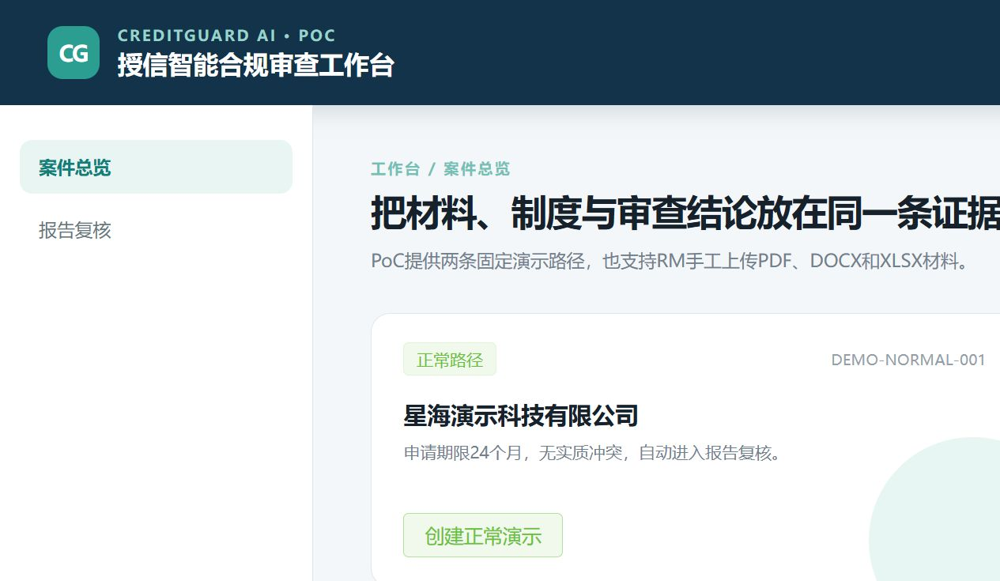
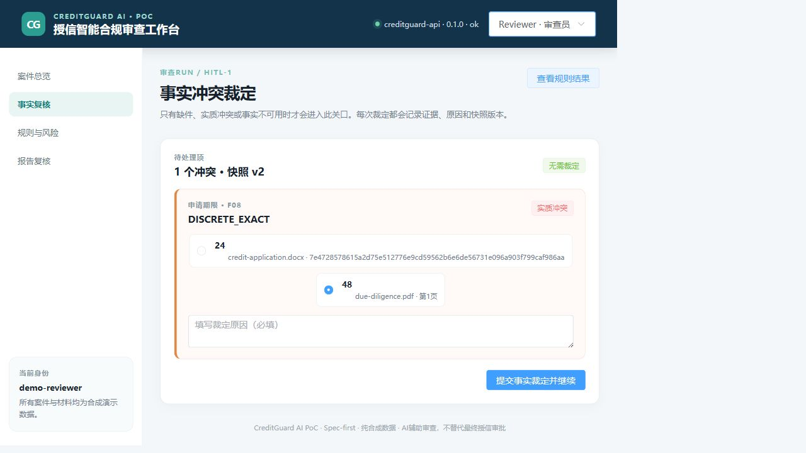
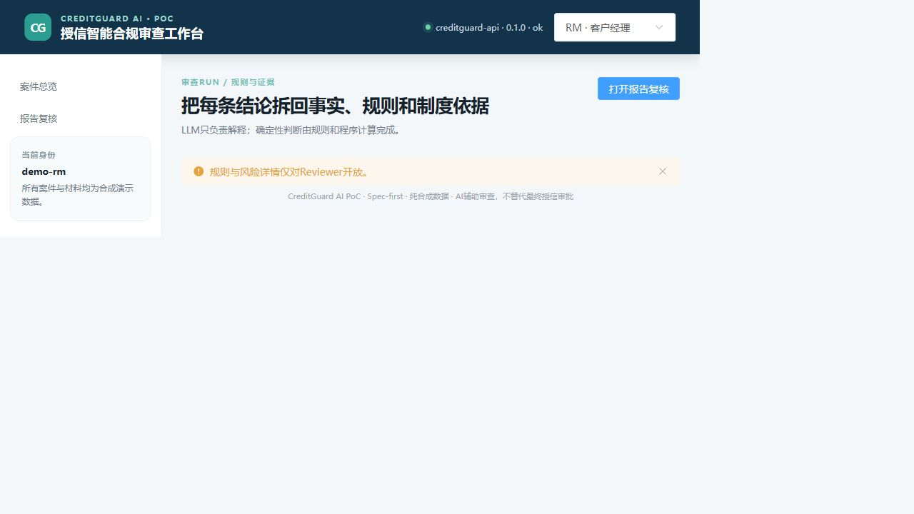
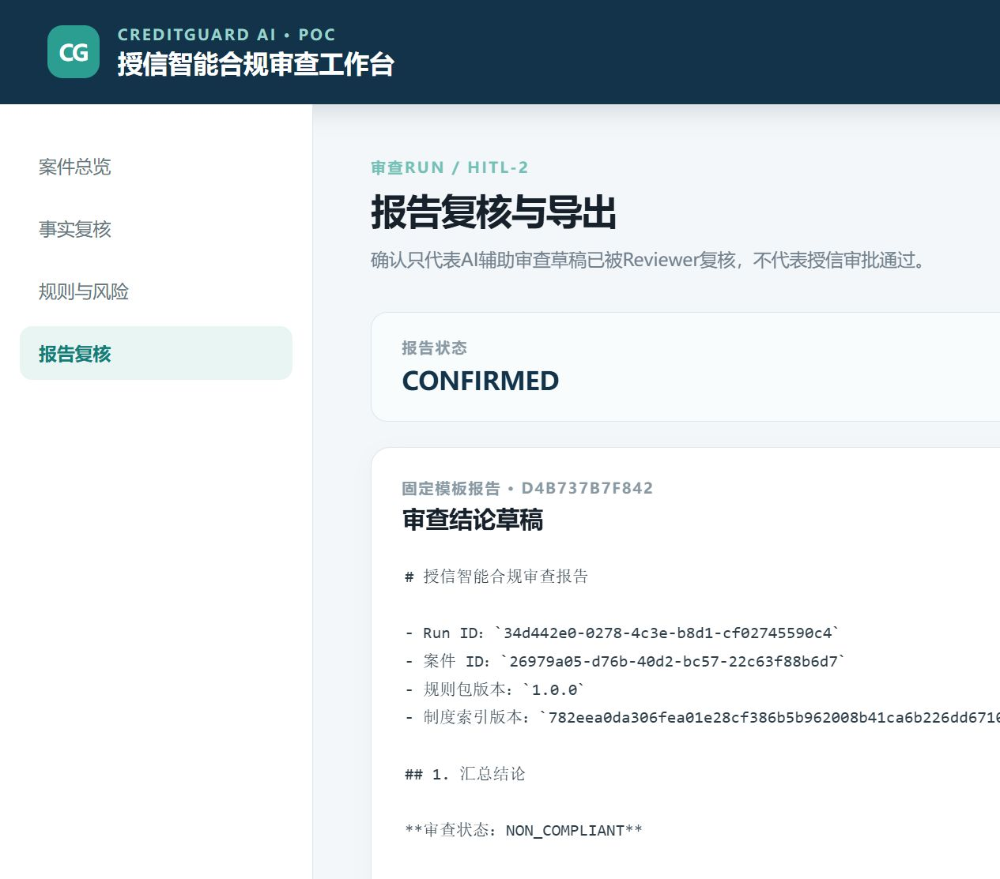

# CreditGuard AI

面向银行对公授信业务的 AI 合规审查助手。

将授信材料解析、事实抽取、矛盾检测、制度检索、规则校验和人工复核串成一条可追溯的审查链路。

> 使用纯合成数据。系统提供 AI 辅助审查，不执行最终授信审批、额度决策或放款。

## 重点工程项目：授信智能合规审查平台

### 项目简介

针对授信材料复杂、制度分散、事实矛盾和人工核验成本高等问题，构建覆盖材料解析、事实抽取、RAG 检索、规则校验、风险解释和人工复核的 AI 合规审查系统。

### 个人贡献

独立完成业务建模、系统架构、后端服务、Vue 工作台、LangGraph 工作流、RAG 检索、规则引擎、测试评测和工程化交付。

### 技术亮点

- PDF、DOCX、XLSX 解析与证据定位；
- BM25 + Dense + RRF + Reranker 混合检索；
- LangGraph 持久化工作流；
- 规则引擎与 LLM 理解分离；
- HITL-1 事实冲突裁定；
- HITL-2 审查报告确认；
- 风险结论绑定证据，Unsupported 内容隔离。

### 已验证结果

- 15 类标准授信事实字段；
- 10 条确定性合规规则；
- 20 个合成评测案件；
- 25 项后端测试通过；
- 正常、高风险和手工上传三条浏览器路径通过。

## 演示截图






[查看演示 GIF](docs/assets/demo.gif)

## 快速运行

```powershell
uv sync
npm.cmd --prefix web ci
.\dev.ps1
```

访问：

- Web：<http://127.0.0.1:5173>
- API：<http://127.0.0.1:8000/docs>

## 演示路径

- 正常案件：创建案件 → 自动解析 → Reviewer 确认报告；
- 高风险案件：采用尽调报告 48 个月期限 → R07 `FAIL` → `NON_COMPLIANT`。

## 技术栈

Python、FastAPI、Vue 3、TypeScript、LangGraph、RAG、FAISS、SQLite、SQLAlchemy、PyMuPDF、python-docx、openpyxl、Playwright。

生成模型配置为 `qwen3.6-flash`；默认本地运行和 CI 使用确定性 Mock。

## 项目结构

```text
backend/   后端服务、解析、规则和工作流
web/       Vue 工作台
config/    合成制度和规则包
fixtures/  演示与工具夹具
evals/     合成评测数据
docs/      架构、演示和评测说明
scripts/   生成、评测和安全检查脚本
```

## 项目边界

不包含真实客户数据、生产认证、真实银行系统连接、最终授信审批和放款操作。

详细内容：

- [系统架构](docs/architecture.md)
- [演示指南](docs/demo-guide.md)
- [评测说明](docs/evaluation.md)
- [安全说明](SECURITY.md)

## License

Apache-2.0
