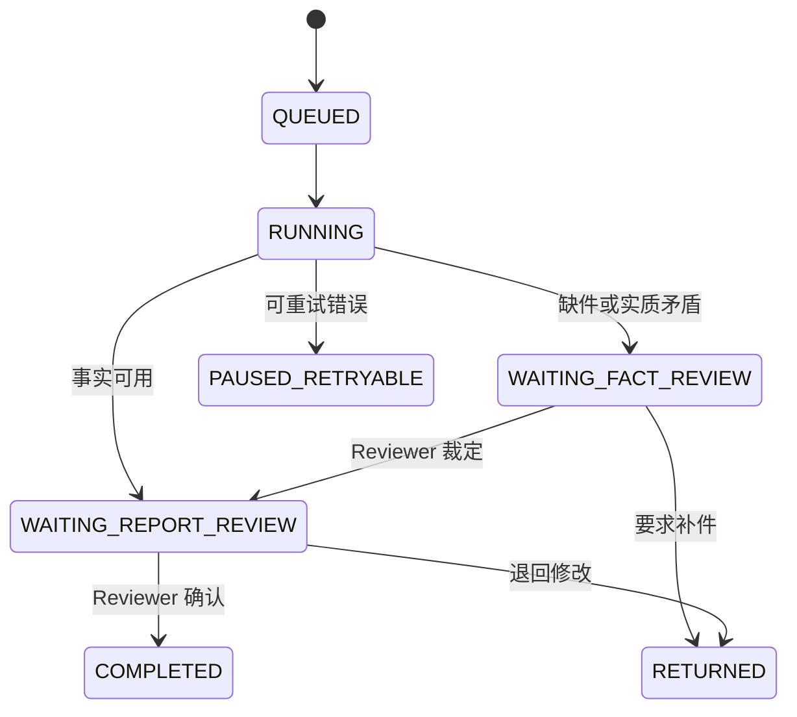

# CreditGuard AI 系统架构

CreditGuard AI 是一个面向银行对公授信材料的本地合成数据参考实现。它把材料解析、事实抽取、制度检索、规则校验、风险解释和人工复核串成可追溯工作流，不执行最终授信审批、额度决策或放款。

## 运行拓扑

```mermaid
flowchart TB
  browser[Vue 3 工作台] --> api[FastAPI]
  api --> db[(SQLite 业务库)]
  api --> storage[本地材料存储]
  api --> jobs[任务租约]
  jobs --> worker[Python Worker]
  worker --> graph[LangGraph 工作流]
  graph --> parser[PDF DOCX XLSX 解析]
  parser --> facts[事实快照与矛盾检测]
  facts --> hitl1[Reviewer 事实裁定]
  hitl1 --> retrieval[BM25 + Dense + RRF + Reranker]
  retrieval --> rules[白名单规则引擎]
  rules --> evidence[风险与证据校验]
  evidence --> hitl2[Reviewer 报告确认]
  hitl2 --> report[安全 Markdown 报告]
```

业务库由 SQLAlchemy/Alembic 管理，LangGraph 使用独立 checkpoint 库。工作流 State 只保存案件、Run、版本、阶段和快照引用，不保存原始文件、完整模型响应、报告正文或密钥。

## 工作流与人工关口



- HITL-1 只在缺件、实质矛盾或事实不可用时触发。Reviewer 选择证据来源或录入修订值，并填写原因。
- HITL-2 对每个 Run 强制执行，确认的是 AI 辅助审查草稿，不代表授信审批通过。
- 每次 Run 采用不可变快照和幂等键，Worker 租约过期后可恢复处理。

## 解析、检索和规则

| 材料 | 主解析器 | 证据定位 | 兜底策略 |
|---|---|---|---|
| PDF | PyMuPDF | 页码/文本块 | 低质量文件调用 MinerU 适配器 |
| DOCX | python-docx | 标题/段落 | 不支持内容进入人工复核 |
| XLSX | openpyxl | 工作表/单元格 | 缓存值缺失进入人工复核 |

制度按标题、条款、语句和表格边界切分，BM25 与归一化向量检索各取候选，使用 Reciprocal Rank Fusion 融合后由 Reranker 选出证据。十条确定性规则由白名单操作符执行，LLM 只负责结构化理解和风险解释，不能生成 SQL、Shell 或任意工具调用。

## 安全边界

- Demo 路由只有在显式启用环境变量时注册。
- 上传校验扩展名、MIME、大小、数量、宏文件、加密文件和路径穿越。
- 材料正文和模型输出均视为不可信数据，材料中的指令不会被执行。
- 工具只读且固定白名单；报告以清洗后的 Markdown/纯文本呈现。
- 审计记录版本、人工决策、工具和模型元数据，不记录 API 密钥、原始外部响应或本机绝对路径。

## 技术取舍

SQLite、单 Worker 和本地 FAISS 便于在 Windows 上复现和检查；生产环境仍需要专用队列、对象存储、索引生命周期管理、强认证和高可用部署。这些基础设施不属于当前公开参考实现的范围。
