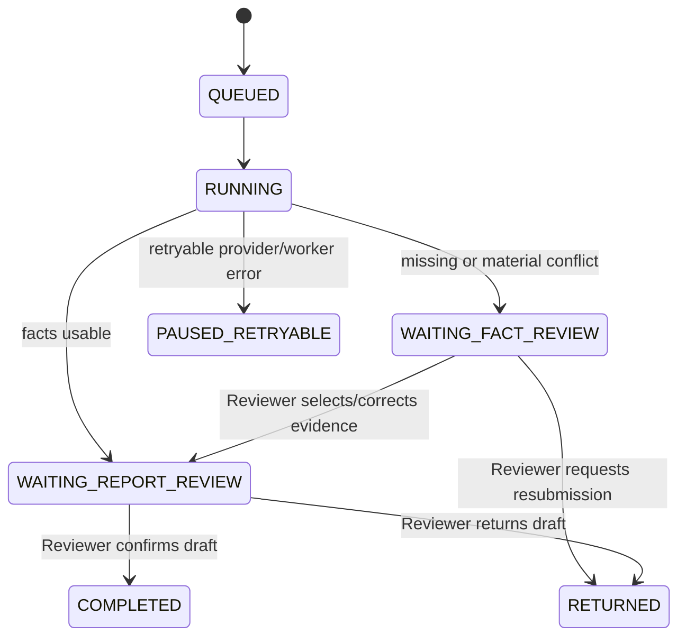

# CreditGuard AI PoC Architecture

## Scope

This document describes the architecture implemented for `SPEC-006` and the narrower PoC scope in `SPEC-002`–`SPEC-005`. It is deliberately smaller than the production target in `SPEC-001`: one Windows host, SQLite, local synthetic policies and deterministic mock providers by default.

## Runtime topology

```mermaid
flowchart TB
  browser[Vue 3 + Element Plus] --> fastapi[FastAPI]
  fastapi --> business[(SQLite business.db)]
  fastapi --> storage[data/storage]
  fastapi --> jobs[TaskJob lease]
  jobs --> worker[Python Worker]
  worker --> graph[LangGraph graph + checkpoint DB]
  graph --> parser[Parser chain]
  parser --> facts[Fact snapshot + conflict snapshot]
  facts --> review1[Reviewer HITL-1]
  review1 --> retrieval[Hybrid policy retrieval]
  retrieval --> rules[Rule engine]
  rules --> evidence[Risk/evidence validator]
  evidence --> review2[Reviewer HITL-2]
  review2 --> report[Safe Markdown report]
```

The business database is managed by SQLAlchemy/Alembic. LangGraph owns a separate checkpoint database. A Run stores immutable JSON snapshots and references rather than putting document text or secrets into graph State.

## Workflow



### State contract

The graph State contains `case_id`, `run_id`, `thread_id`, `trace_id`, workflow/rule/policy/model versions, material version IDs, current stage, snapshot references, human-gate references, retry count and typed error metadata. It does not contain raw files, full model responses, report Markdown or any secret.

### Human-in-the-loop placement

HITL-1 is conditional. The Worker pauses after parsing and conflict detection when a required material is missing, a material conflict exists or a fact cannot be used deterministically. The Reviewer selects a source or enters a corrected value with a reason. The API checks the expected snapshot version and records the decision before the rule stage continues.

HITL-2 is mandatory for every Run. It is a report review, not a lending approval. The fixed report template is rendered from facts, rules, tools and evidence references; only after confirmation does RM gain access to the confirmed report.

## Parsing and evidence

| Input | Primary parser | Evidence locator | Fallback |
| --- | --- | --- | --- |
| PDF | PyMuPDF | page/text block | MinerU API for image-like or low-quality PDFs |
| DOCX | python-docx | heading/paragraph | manual review for unsupported content |
| XLSX | openpyxl | sheet/cell | manual review when formula cache is missing |

The parser rejects encrypted files and unsupported legacy/macro formats. Each upload is immutable; a re-upload creates a new version. Qwen-compatible extraction is schema-constrained, then dates, amounts, currencies, terms and percentages are normalized by code.

## Retrieval and rules

Five synthetic Markdown policies are chunked at heading, clause, sentence and table boundaries. Chunks are at most 600 Chinese characters with approximately 80 characters of natural-boundary overlap. BM25 and dense search each return 30 candidates. Reciprocal Rank Fusion uses:

```text
RRF(d) = Σ 1 / (60 + rank_i(d))
```

The 20 fused candidates are reranked and the top five are retained as evidence. Rule query templates are versioned; the LLM cannot invent arbitrary retrieval queries.

Ten rules are evaluated by a whitelist rule engine, never by `eval`. Results are `PASS`, `WARN`, `FAIL` or `NEEDS_REVIEW`; missing data, unresolved conflicts and failed tools cannot be interpreted as approval.

## Security boundaries

- Demo routes are not registered unless `CREDIT_REVIEW_DEMO_MODE=true`.
- The only tools are local, read-only and allowlisted.
- LLM output is treated as untrusted data; material-embedded instructions are never executed.
- Files are checked by extension/MIME, size, count, macro/encryption and storage path.
- Report Markdown is displayed in a plain-text `<pre>` and is sanitized before export.
- Audit records include versions, decisions, retries and tool/model metadata, never API keys.

## Operational trade-offs

SQLite and a single Worker make the PoC reproducible on Windows and easy to inspect, but they are not a production HA design. FAISS is rebuilt/persisted for the synthetic policy pack; a production deployment would use managed index lifecycle, stronger authentication, queue infrastructure and a dedicated object store. These are explicitly out of scope for v0.1.0.
